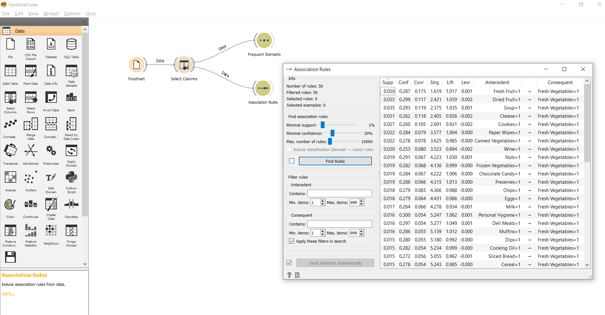
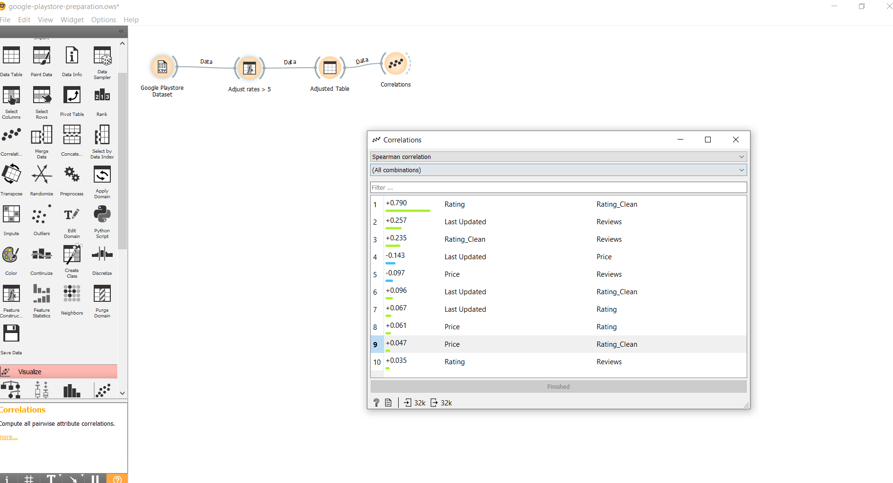

# INF331-2020

**Rodrigo Yokoo Siqueira Bueno**

# Projeto Orange / Regras de Associação para Foodmart
## Imagem do Projeto

## Arquivo do Projeto
[foodmart.ows](orange/foodmart.ows)

# Projeto Orange / Análise de Dados do Google PlayStore
Imagem do Projeto

Arquivo do Projeto
[google-playstore-preparation.ows](orange/google-playstore-preparation.ows)

# Gráfico(s) de Análise
Apresente a seguir o(s) gráfico(s) de análise produzidos (se houver) com legendas.

# Projeto de Composição de Componentes para Recomendação
Imagem (PNG) do diagrama de componentes (veja exemplos abaixo).

# Projeto de Composição de Componentes para Pedido
Diagrama de Componentes
Imagem (PNG) do diagrama de componentes do pedido de um produto (veja exemplos abaixo).

Diagrama de Interfaces
Imagem (PNG) do detalhamento de interfaces referentes aos componentes.

