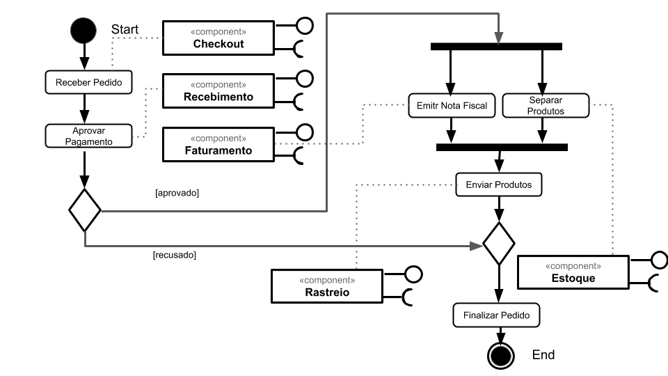
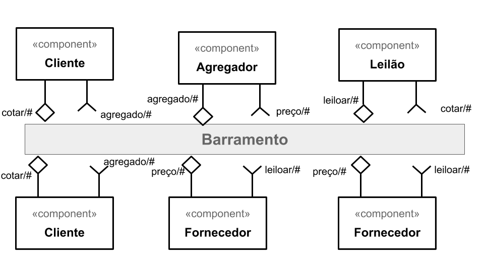
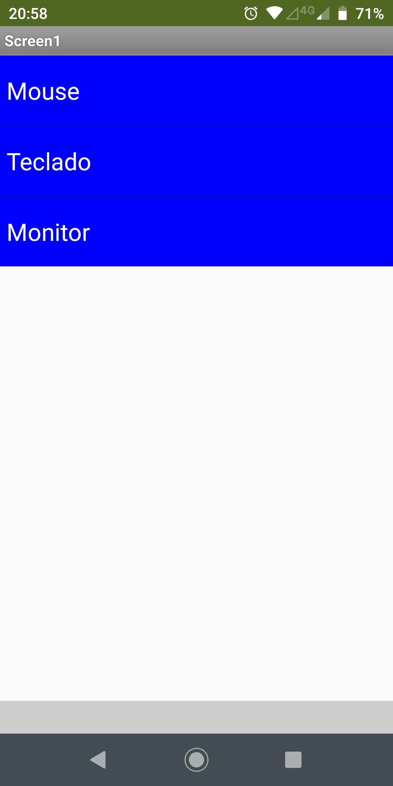
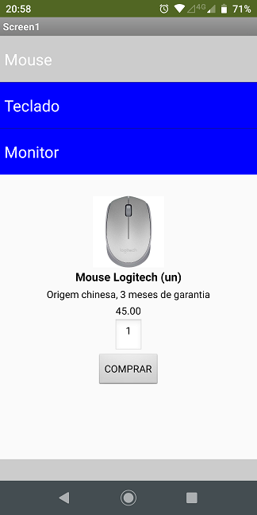
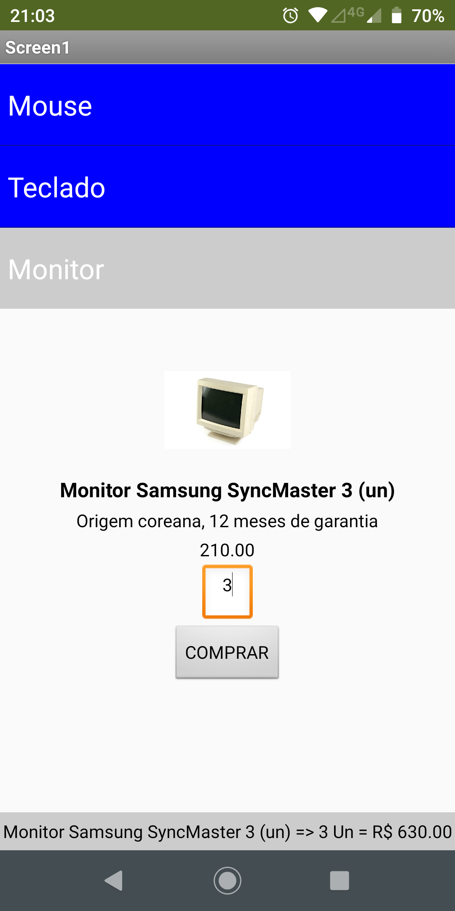
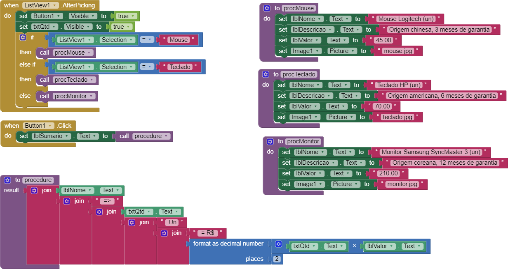

# INF331-2020

**Rodrigo Yokoo Siqueira Bueno**

# Orquestração e Coreografia

# Lab03 - Model-View-Controller

## Tarefa 1

## Tarefa 2
> Coloque a imagem do PNG do seu diagrama como ilustrado abaixo:
>
> 
>
> Nesta tarefa não há um diagrama de atividades. O leilão é um processo que emerge da interação dos componentes. Liste a seguir qual a sequência esperada de ações que emergirá da interação como uma lista. Quando ser referir a uma mensagem, indique o tópico/interface envolvido. Exemplo:
> 1. o componente X posta uma mensagem com o tópico Y;
> 2. os componentes do tipo A que assinam o tópico X fazem Z e postam uma mensagem com o tópico W.

## Tarefa 3

> 
> 
> 
>  

[Link para o arquivo do aplicativo](app/Tarefa_3.aia)
