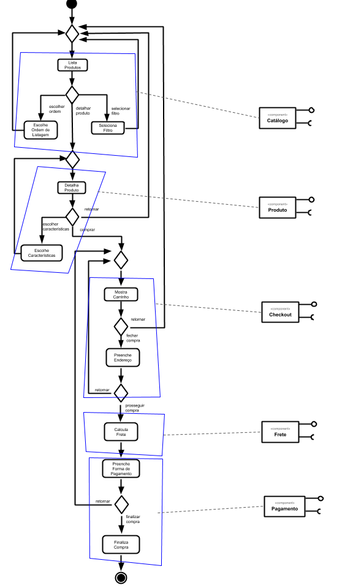
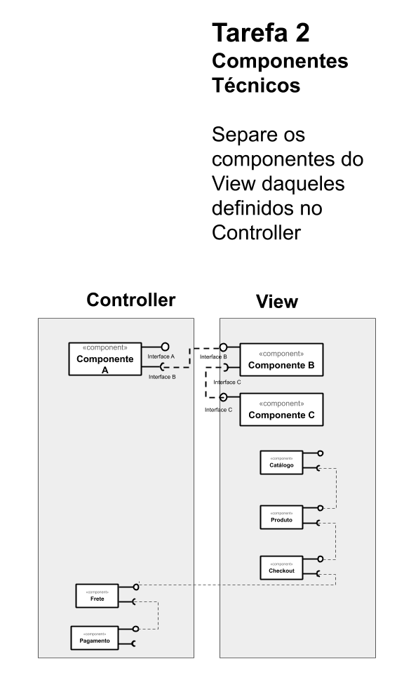
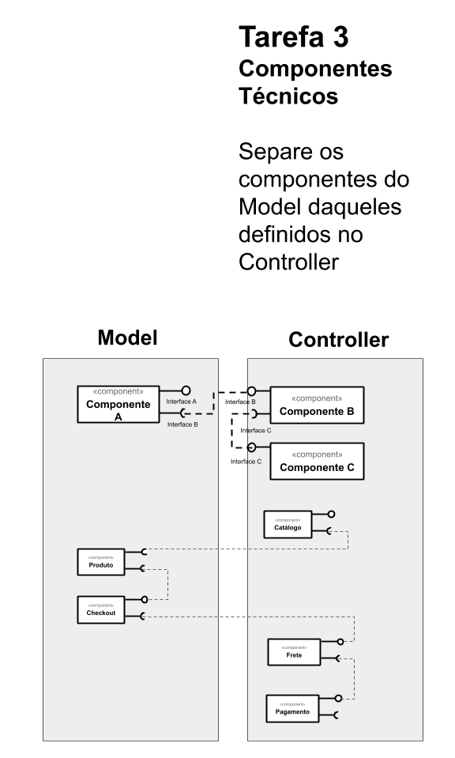

# Lab04 - Serviços

Estrutura de pastas:

~~~
├── README.md  <- arquivo apresentando a tarefa
│
└── images     <- arquivos de imagens usadas no documento
~~~

## Tarefa 1

> 

## Tarefa 2

> 

## Tarefa 3

> 

## Tarefa 4

### Serviço `<n>`

* **Título do serviço**: `<título>`
* **Breve descrição**:
  > Breve descrição do serviço
* **URL completa da requisição**: `<URL>`
* **Cabeçalho HTTP da chamada**:
~~~http
<cabeçalho>
~~~
* **Cabeçalho HTTP da resposta**:
~~~http
<cabeçalho>
~~~
* **Conteúdo da resposta**:
~~~json
<conteúdo>
~~~