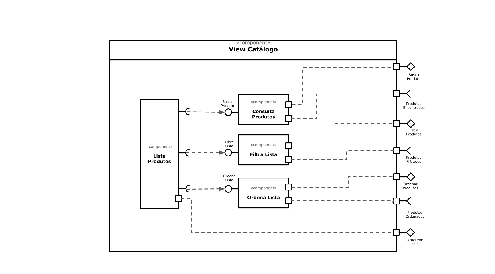

# Lab05 - Subcomponentes e Páginas Dinâmicas

Estrutura de pastas:

~~~
├── README.md  <- arquivo apresentando a tarefa
│
└── images     <- arquivos de imagens usadas no documento
~~~

## Tarefa 1

## Tarefa 2
Link para o projeto no Codepen: [React 03 - Componente Barra](https://codepen.io/rysb/pen/eYZevYW)

**HTML**
~~~html

~~~

**JavaScript**
~~~javascript
class Barra extends React.Component {
  render() {
    let resultado = "";
      for (let b = 1; b <= this.props.tamanho; b++)
        resultado += this.props.caracter;            
    return resultado;
  }
}

const elemento = 

                   <h2>O dinossauro</h2>
                   <Barra tamanho="2" caracter="*"/>
         
                   <Barra tamanho="4" caracter="+"/>
         
                   <Barra tamanho="6" caracter="#"/>
         
                   <Barra tamanho="8" caracter="O"/>
         
                   <Barra tamanho="10" caracter="&"/>
         
                   <Barra tamanho="12" caracter="@"/>
                   <h2>pulou na lama.</h2>
                 

ReactDOM.render(elemento, 
        document.getElementById("root"));

~~~